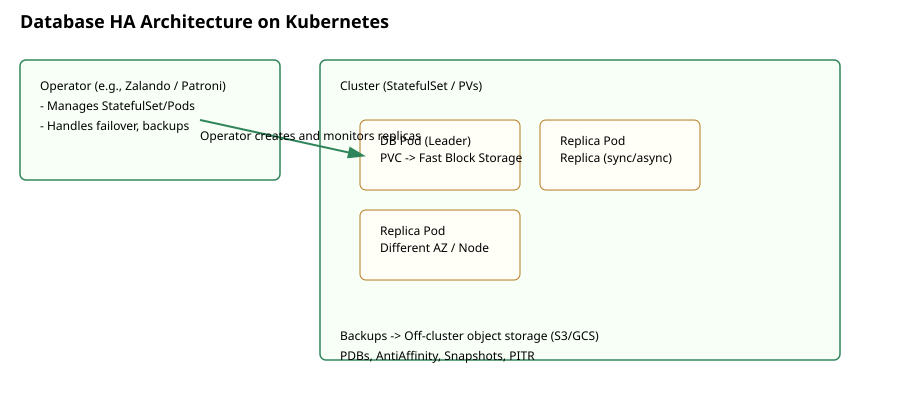

# SOP: Managing Databases on Kubernetes with High Availability

This SOP outlines recommended practices, runbooks, and operational checks for running stateful databases on Kubernetes with high availability (HA). It adapts general principles from real-world engineering posts (example: Airbnb's write-up on distributed databases on Kubernetes) and translates them into actionable steps.

Reference: Achieving High Availability with Distributed Database on Kubernetes at Airbnb — https://airbnb.tech/infrastructure/achieving-high-availability-with-distributed-database-on-kubernetes-at-airbnb/

## Scope
- Applies to relational and distributed databases running on Kubernetes clusters (Postgres, MySQL, Vitess, CockroachDB, Cassandra, etc.).
- Focuses on HA patterns: replication, failover, backups, network topologies, and testing.

## Architecture & Design Principles
- Prefer a purpose-built operator where available (e.g., Zalando Postgres Operator, CrunchyData Postgres Operator, Vitess Operator, CockroachDB Operator). Operators handle lifecycle, backups, and failover with Kubernetes-native APIs.
- Use StatefulSets for simple stateful workloads only when an operator is not required.
- Design for availability zones/regions: ensure replicas are spread across failure domains (node/zone/region) using nodeAffinity and podAntiAffinity.
- Use PodDisruptionBudgets (PDBs) to prevent simultaneous eviction of quorum members.
- Prefer storage classes that support synchronous or fast replication across AZs where possible; evaluate RPO/RTO needs carefully.

## Storage & Persistence
- Use managed block storage (cloud PVs) with appropriate performance and IOPS characteristics.
- Use ReadWriteOnce-many (RWO) PVs for single-writer databases and consider clustered filesystems or distributed storage (e.g., Ceph/Rook) only when necessary.
- Ensure retention and snapshotting capabilities exist at the storage class level; schedule frequent snapshots for quick recovery.

## Replication & Failover
- Configure logical or physical replication depending on database type and operator support.
- Ensure automated failover with clear leader election (operator-managed is recommended). Test failover with controlled failover drills.
- Maintain at least N replicas to tolerate target failure domains (common minimum: 3 replicas for quorum-based systems).

## Networking & Security
- Secure intra-cluster traffic: use TLS between database nodes and between apps and DB. Inject certs via Secrets and consider using a service mesh for mTLS where appropriate.
- Use NetworkPolicies to restrict which namespaces or services can reach DB ports.
- Avoid exposing DB directly via external LoadBalancers; use bastion/jump hosts or API gateways for controlled access.

## Backups & Point-in-Time Recovery (PITR)
- Enable regular backups (logical dumps, physical snapshots, and WAL shipping for PITR). Store backups in durable, off-cluster storage (S3, GCS, Azure Blob).
- Test restores regularly (monthly at minimum) and document RTO/RPO expectations.

## Observability & Alerting
- Collect metrics (CPU, memory, disk usage, IOPS, connections, replication lag, commit latency) and expose them to a metrics backend (Prometheus/Grafana).
- Enable distributed tracing (where applicable) for queries that traverse services.
- Create alerts for: replication lag, high commit latency, node OOMs, disk saturation, PDB violations, failed backups, and high error rates.

## Operational Runbooks (Playbooks)

Incident: Primary/Leader Failure
1. Verify leader status via operator CLI or DB tooling.
2. Check replication lag on replicas.
3. If automatic failover occurred: validate new leader health and resume writes.
4. If failover did NOT occur: trigger manual failover following operator docs. Promote the most up-to-date replica.
5. Rebuild or reattach the failed node, resync it as a replica.
6. Post-incident: run consistency checks and verify application-level reads/writes.

Incident: Replica Lag or Slowdowns
1. Identify slow queries and resource hotspots.
2. Scale read replicas if supported and safe for your topology.
3. Check storage latency and IOPS; move to higher-performance storage if needed.
4. If network congestion is suspected, check CNI metrics and cloud network health.

Backup Failure
1. Verify backup job logs; attempt an immediate retry to a different storage endpoint if transient.
2. If backup consistently fails, escalate and run an on-demand snapshot; document gap in backup window.

Disaster Recovery (DR) — Regional Outage
1. If multi-region failover is configured, validate DNS/ingress changes or route weights.
2. Bring up secondary region replicas as primaries if required and supported by your replication model.
3. Ensure downstream applications can safely reconnect and rehydrate caches.

## Testing & Chaos Engineering
- Regularly run failure drills: node termination, AZ blackouts, operator restart, storage detachment, and simulated high-latency networks.
- Test schema migrations on staging clusters with similar data volumes.

## Maintenance & Upgrades
- Use rolling upgrades with podAntiAffinity to preserve quorum.
- Drain and cordon nodes one at a time; ensure PDBs prevent multiple quorum members from being evicted.
- Test minor and major DB engine upgrades in a canary namespace first.

## Access Control & Secrets
- Store DB credentials in Kubernetes `Secrets` backed by an external KMS where possible.
- Use least privilege principle for service accounts and RBAC; avoid granting broad cluster-admin rights to DB operator service accounts unless required.

## Logs & Forensics
- Centralize database logs (slow-query logs, error logs) to a log aggregator (ELK/EFK, Splunk) with retention policies aligned to compliance requirements.

## Common Tools & Operators
- Postgres: Zalando Postgres Operator, CrunchyData Postgres Operator, Patroni (with Operator integration)
- MySQL: Oracle MySQL Operator, Vitess (for sharded MySQL)
- CockroachDB: CockroachDB Operator (or managed CockroachDB Cloud)
- Cassandra: Cass Operator, K8ssandra
- Backup tools: Velero, Stash, provider-specific snapshot controllers, WAL-G/WAL-E for WAL shipping

## GitOps & Configuration Management
- Keep operator configurations, backup policies, and PDB/anti-affinity rules under Git control.
- Use PR-based change reviews for any change that affects topology, backups, or replication.

## Example checklist before promotion to production
- Operator selected and validated in staging.
- At least 3 replicas across 2+ AZs.
- PDBs configured to protect quorum.
- Backup configured with PITR and off-cluster storage.
- Monitoring and alerts in place with escalation paths.
- Runbooks documented and smoke-tested with an on-call engineer.

## Appendix: Quick commands and examples
- Check StatefulSet pods: `kubectl get statefulsets -n <ns>`
- Check pods and node spread: `kubectl get pods -o wide -n <ns>`
- Describe a PVC: `kubectl describe pvc <pvc-name> -n <ns>`
- Operator CLI / CR examples: see operator docs for custom resources (CRs) and backup CRs.

## Further Reading
- Airbnb: https://airbnb.tech/infrastructure/achieving-high-availability-with-distributed-database-on-kubernetes-at-airbnb/
- Zalando Postgres Operator: https://github.com/zalando/postgres-operator
- CrunchyData: https://www.crunchydata.com/
- Vitess: https://vitess.io/

---
Notes: This SOP is a starting point. I can add concrete example manifests (Zalando Postgres CR, Patroni StatefulSet, Velero backup CRs) and test playbooks next.
